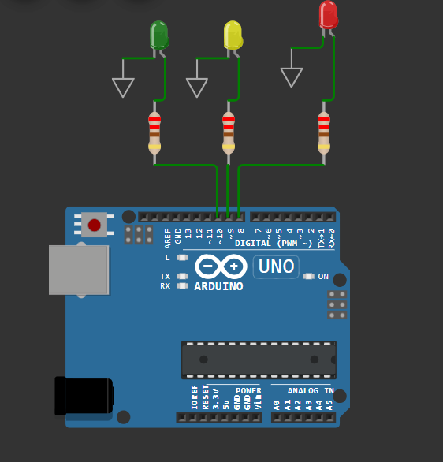

# 🚦 Traffic Light Controller using Finite State Machine (FSM)

## Project Overview

This project implements a Traffic Light Controller using the Finite State Machine (FSM) design approach on an Arduino Uno.

Instead of simply turning LEDs on and off sequentially, the controller models the traffic signal as a collection of well-defined states. Each state determines the output of the traffic lights and controls the transition to the next state after a specified delay.

The project was developed to strengthen my understanding of Embedded Systems, C Programming, Digital Electronics, and Finite State Machine (FSM) design principles.

---

## Project Objective

The objective of this project is to design and implement a simple embedded control system that demonstrates how Finite State Machines are used in real-world automation systems.

The controller cycles through four traffic light states:

- 🔴 Red
- 🔴🟡 Red + Yellow
- 🟢 Green
- 🟡 Yellow

before repeating continuously.

---

## Features

- Arduino Uno based implementation
- Finite State Machine architecture
- Four traffic light states
- Simple and readable Embedded C code
- Simulated using Wokwi
- Version controlled using Git and GitHub

---

## Hardware Used

- Arduino Uno
- Red LED
- Yellow LED
- Green LED
- 3 × 220Ω Resistors
- Jumper Wires
## Hardware Connection

---

## Software Used

- Arduino IDE
- Wokwi Simulator
- Visual Studio Code
- Git
- GitHub